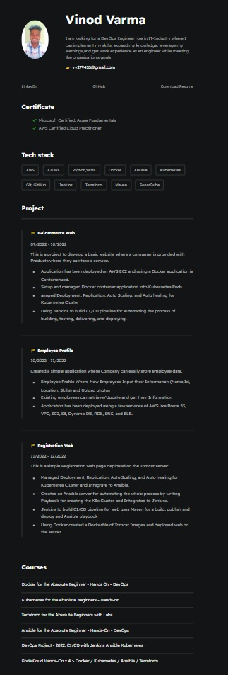

# [Digital-Resume](https://github.com/Vinodvarma1999/Digital-Resume.git)

 <h3> This Repositories contain the code of my digital resume </h3>
 
<h4> Thanks to <b> <a href=https://github.com/ibilalkayy>Bilal Khan </a> for this <a href=https://github.com/ibilalkayy/digital-resume.git> Repository </a> </b> </h4>

# Resume ScreenShot  

